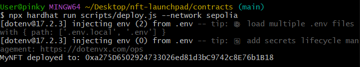
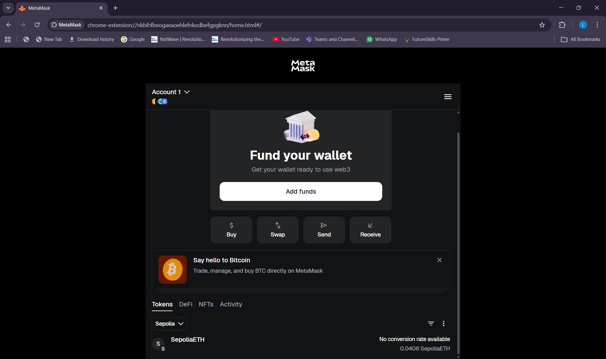
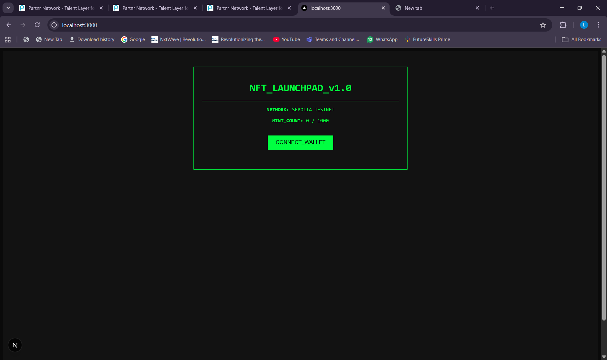
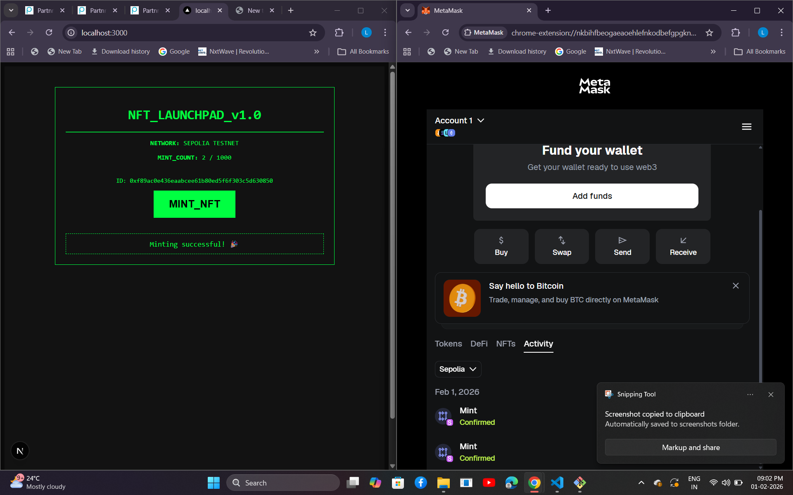

# NFT Launchpad – Full Stack Web3 DApp

This project is a full-stack NFT Launchpad built using Solidity, Hardhat, Next.js, Ethers.js, and MetaMask, deployed on the Sepolia Ethereum Testnet.
It allows users to:
- Connect their wallet
- View sale status
- View total NFTs minted
- Mint NFTs on-chain
- See real-time transaction feedback

---

## Tech Stack

#### Smart Contract

- Solidity ^0.8.x
- OpenZeppelin ERC721
- Hardhat
- Sepolia Testnet

#### Frontend

- Next.js (App Router)
- React
- Ethers.js
- MetaMask

### Infrastructure

- IPFS (for metadata – simulated)
- Docker & Docker Compose
- GitHub

---

##  Project Structure
```
nft-launchpad/
│
├── contracts/
│   ├── contracts/
│   │   ├── MyNFT.sol
│   │   └── Lock.sol
│   ├── scripts/
│   │   └── deploy.js
│   ├── test/
│   │   └── MyNFT.test.js
│   ├── hardhat.config.js
│   ├── .env.example
│   └── package.json
│
├── frontend/
│   ├── app/
│   │   ├── page.js
│   │   └── globals.css
│   ├── package.json
│   └── next.config.mjs
│
├── metadata/
│   └── sample NFT metadata files
│
├── docker-compose.yml
├── Dockerfile
└── README.md
```

---

### Prerequisites

Ensure the following are installed:
- Node.js v18+
- npm
- MetaMask browser extension
- Git


---

## Smart Contract Details

- Contract Name: MyNFT
- Standard: ERC-721
- Network: Sepolia Testnet
- Features:
   - Public minting
   - Token counter to track minted NFTs
   - Metadata support using base URI

---

## 1.Install Dependencies (Contracts)
```bash
cd contracts
npm install
```

## 2.Configure Environment Variables

Create a .env file inside the contracts folder:
```env
SEPOLIA_RPC_URL=your_sepolia_rpc_url
PRIVATE_KEY=your_wallet_private_key
```
Never share your private key publicly.

## 3.Compile the Smart Contract
```bash
npx hardhat compile
```
## 4.Deploy Contract to Sepolia
```bash
npx hardhat run scripts/deploy.js --network sepolia
```
output example:
```
MyNFT deployed to: 0xa275D6502924733026ed81d3bC9742c8E76b1B18
```
Save this contract address for frontend use.

## 5.Start the Frontend
```bash
cd ../frontend
npm install
npm run dev
```
Open in browser:
```
http://localhost:3000
```

## To Test the Application

1. Open http://localhost:3000
2. Click Connect Wallet
3. Ensure MetaMask is set to Sepolia Testnet
4. Click Mint NFT
5. Confirm transaction in MetaMask
6. Mint count updates automatically
7. Transaction can be viewed on Sepolia Etherscan

## Screenshots









---

## Conclusion

- NFT smart contract created and deployed on Sepolia
- Frontend connected with MetaMask
- NFTs successfully minted from the UI
- Transactions verified on MetaMask and Etherscan

---
